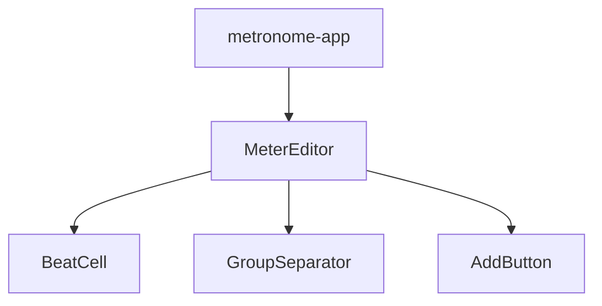

# Technical Design: meter-editor

## Overview
本機能は、メトロノームの混合拍子を視覚的に編集するためのReactコンポーネントを提供する。ユーザーは数値入力に頼らず、画面上のビートを直接操作（タップ/クリック）することで、複雑なリズム構成を直感的に作成できる。

### Goals
- インタラクティブなビート編集UIの提供。
- 混合拍子を表現するためのビートのグループ化機能。
- アクセントレベル（4段階）の視覚的な設定。
- 他のコンポーネント（音声エンジン等）が利用可能なデータ形式での出力。

### Non-Goals
- 音声再生ロジックの実装（`audio-engine`の責務）。
- 設定の永続化（`metronome-app`の責務）。

## Boundary Commitments

### This Spec Owns
- `MeterEditor` コンポーネントおよびその内部子コンポーネント。
- ビートの追加・削除、アクセント変更、グループ化の内部状態管理。
- メーター構成データのバリデーションと出力形式の定義。

### Out of Boundary
- メトロノームの再生停止制御。
- テンポ、ピッチなどの音声パラメータ設定。

### Allowed Dependencies
- React (UI Framework)
- Tailwind CSS (Styling)

## Architecture

### Architecture Pattern & Boundary Map
`MeterEditor` は単一の親コンポーネントとして、内部に `BeatCell` と `GroupSeparator` を配置する。状態は `MeterEditor` で一元管理し、単方向データフローで子に伝える。



### Technology Stack

| Layer | Choice / Version | Role in Feature | Notes |
|-------|------------------|-----------------|-------|
| Frontend | React 18+ | UIコンポーネントフレームワーク | |
| Styling | Tailwind CSS | スタイリング | CSS Gridを活用 |
| Types | TypeScript | 型定義 | |

## File Structure Plan

### Directory Structure
```
src/components/meter-editor/
├── index.tsx           # メインコンポーネント
├── BeatCell.tsx        # ビート単位のUI
├── GroupSeparator.tsx  # ビート間の区切りUI
├── types.ts            # 型定義
└── styles.css          # 必要に応じた補助スタイル
```

## Requirements Traceability

| Requirement | Summary | Components | Interfaces |
|-------------|---------|------------|------------|
| 1.1 | ビート追加 | MeterEditor | `handleAddBeat` |
| 1.2 | ビート削除 | BeatCell | `onDelete` |
| 2.1 | アクセント切り替え | BeatCell | `onClick` (toggle) |
| 3.1 | グループ化トグル | GroupSeparator | `onClick` (toggle) |
| 4.1 | 状態出力 | MeterEditor | `onChange` callback |

## Components and Interfaces

### UI Layer

#### MeterEditor

| Field | Detail |
|-------|--------|
| Intent | メーター編集UIの全体管理と状態保持 |
| Requirements | 1.1, 4.1, 4.2 |

**Responsibilities & Constraints**
- `beats` (AccentLevel[]) と `groupIndices` (number[]) の状態管理。
- ビート追加・削除時のインデックス整合性の維持。

**State Management**
- `beats`: `AccentLevel[]`
- `groupIndices`: `number[]` (区切りが入るビートの0-based index)

**Output Interface**
- `onChange`: `(config: MeterConfig) => void`
  - `MeterConfig.beats` は `audio-engine` の `setMeter` にそのまま渡すことができる平坦な配列である。

#### BeatCell

| Field | Detail |
|-------|--------|
| Intent | 各拍の表示とアクセント変更操作 |
| Requirements | 1.2, 2.1, 2.2 |

#### GroupSeparator

| Field | Detail |
|-------|--------|
| Intent | ビート間の境界設定と視覚的フィードバック |
| Requirements | 3.1, 3.2 |

## Data Models

### Domain Model
```typescript
type AccentLevel = 'strong' | 'medium' | 'weak' | 'none';

interface MeterConfig {
  beats: AccentLevel[]; // Flat array of accent levels for audio-engine
  groupIndices: number[]; // For visual grouping in UI, e.g. [2, 5] for (2+3+2)
}
```

## Testing Strategy
- **Unit Tests**:
  - `AccentLevel` のトグルロジックが正しい順序で循環するか。
  - ビート削除時に `groupIndices` が適切に更新（またはリセット）されるか。
- **Integration Tests**:
  - ビートを追加した際に、UI上に新しい `BeatCell` が正しく描画されるか。
  - セパレーターをクリックした際に、対応する `groupIndices` が変化するか。
- **UI Tests**:
  - CSS Gridによるレイアウトが、異なるビート数で正しくレスポンシブに動作するか。
