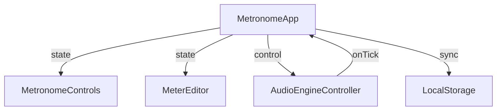

# Technical Design: metronome-app

## Overview
本機能は、音声エンジン（audio-engine）とユーザーインターフェース（meter-editor）を統合し、エンドユーザーが操作可能なメトロノームアプリケーションを構築します。状態管理、設定の永続化、およびインタラクティブなテンポ制御を提供します。

### Goals
- 音声エンジンとメーターエディターの完全な統合。
- BPM、メーター設定、音量のLocalStorageへの永続化。
- 直感的なテンポ操作（タップテンポ、スライダー、入力）。
- 再生中における拍のリアルタイム視覚フィードバック。

### Non-Goals
- 独自の音声生成ロジックの実装。
- 独自のビート編集UIの実装。

## Boundary Commitments

### This Spec Owns
- アプリ全体のレイアウトとコンポーネントの配置。
- BPM、メーター構成、再生状態、音量の集中管理（Source of Truth）。
- LocalStorageへのデータの保存と復元。
- タップテンポの計算ロジック。
- 音声エンジンへのパラメータ反映とコールバックの購読。

### Out of Boundary
- 高精度な音声タイミング制御（`audio-engine`が担当）。
- 各拍のアクセント設定やグループ化の内部ロジック（`meter-editor`が担当）。

### Allowed Dependencies
- `audio-engine` (AudioEngineController, types)
- `meter-editor` (MeterEditor, types)
- React 18+
- Web Storage API (LocalStorage)

### Revalidation Triggers
- `AudioEngineController` のインターフェース変更。
- `MeterConfig` 型の定義変更。

## Architecture

### Architecture Pattern & Boundary Map
Reactの単方向データフローに基づき、`App`コンポーネント（またはCustom Hook）が状態を保持し、子コンポーネントおよび外部エンジンへ配信する。



### Technology Stack

| Layer | Choice / Version | Role in Feature | Notes |
|-------|------------------|-----------------|-------|
| Frontend | React 18+ | アプリケーションフレームワーク | |
| State | React Context/Hooks | 状態管理 | |
| Storage | LocalStorage | 設定の永続化 | |
| Styling | Tailwind CSS | レイアウト・装飾 | |

## File Structure Plan

### Directory Structure
```
src/
├── App.tsx                 # エントリポイント・全体レイアウト
├── hooks/
│   ├── useMetronome.ts     # メトロノーム主ロジック（エンジン連携・状態管理）
│   ├── useTapTempo.ts      # タップテンポ計算ロジック
│   └── useLocalStorage.ts  # 永続化ヘルパー
├── components/
│   └── MetronomeControls.tsx # 再生・テンポ制御UI
└── utils/
    └── meterConverter.ts   # MeterConfigからエンジン用形式への変換
```

## Requirements Traceability

| Requirement | Summary | Components | Interfaces | Flows |
|-------------|---------|------------|------------|-------|
| 1.1 | UI統合 | App | Layout | - |
| 1.2 | エンジン初期化 | useMetronome | constructor | - |
| 2.1 | テンポ調整範囲 | MetronomeControls | input/slider | - |
| 2.2 | スライダー操作 | MetronomeControls | setTempo | - |
| 2.3 | タップテンポ | useTapTempo | calculateBPM | - |
| 3.1 | 開始ボタン | MetronomeControls | start() | - |
| 3.2 | ラベル切り替え | MetronomeControls | isPlaying state | - |
| 3.3 | 停止ボタン | MetronomeControls | stop() | - |
| 3.4 | 拍のハイライト | App / MeterEditor | onTick / activeBeat | - |
| 4.1 | 保存 | useLocalStorage | setItem | - |
| 4.2 | 読み込み | useLocalStorage | getItem | - |
| 4.3 | デフォルト設定 | useMetronome | default state | - |
| 5.1 | メーター同期 | useMetronome | setMeter | - |

## Components and Interfaces

### UI Layer

#### App
- **Intent**: アプリのルート。レイアウトとコンポーネント間の調整を行う。
- **Requirements**: 1.1, 3.4
- **State Management**: `currentBeatIndex`（エンジンからのtickに連動）

#### MetronomeControls
- **Intent**: ユーザーからの入力（BPM、再生停止、タップテンポ）を処理する。
- **Requirements**: 2.1, 2.2, 3.1, 3.2, 3.3
- **Props**:
  ```typescript
  interface MetronomeControlsProps {
    bpm: number;
    isPlaying: boolean;
    onBpmChange: (bpm: number) => void;
    onTogglePlay: () => void;
    onTap: () => void;
  }
  ```

### Logic Layer (Hooks)

#### useMetronome
- **Intent**: 音声エンジンへの操作と、アプリ全体の主要な状態をカプセル化する。
- **Requirements**: 1.2, 4.3, 5.1
- **Contracts**: State, Service
- **Responsibilities**:
  - `AudioEngineController` のインスタンス保持。
  - メーター構成変更時のエンジンへの通知。
  - 設定変更時の永続化トリガー。

#### useTapTempo
- **Intent**: タップイベントからBPMを導出する。
- **Requirements**: 2.3
- **Interface**:
  ```typescript
  interface UseTapTempoResult {
    tap: () => void;
    reset: () => void;
  }
  ```

## Data Models

### Domain Model
```typescript
interface AppState {
  bpm: number;
  meterConfig: MeterConfig;
  volume: number;
}
```

## Testing Strategy
- **Integration Tests**:
  - `MeterEditor` での変更が `AudioEngineController.setMeter` を正しく呼び出すか。
  - `onTick` コールバックによって `activeBeat` 状態が正しく更新されるか。
  - `localStorage` に保存された値が、リロード時に正しく復元されるか。
- **Unit Tests**:
  - `meterConverter.ts`: `groupIndices` からグループサイズの配列への変換ロジック。
  - `useTapTempo`: 一定間隔のタップに対する正確なBPM計算。
- **UI Tests**:
  - 再生中、開始ボタンのラベルが「停止」に変わっているか。
  - スライダーを動かした際に数値表示が連動するか。
